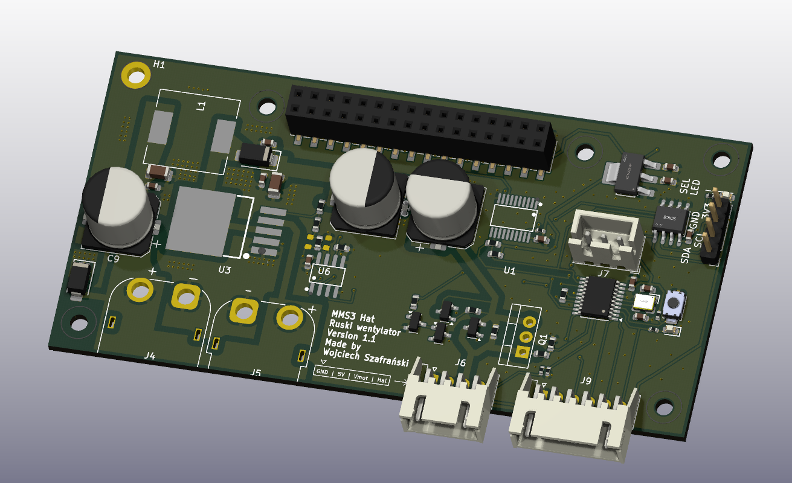

# Hat ruski wentylator do pieca

## Sekcja 1: Dokumentacja Hat'a

### Krótki opis projektu
Dedykowany moduł sterujący przeznaczony do obsługi ruskiego wentylatora pieca . Urządzenie bazuje na mikrokontrolerze **CH32V003**, który realizuje zadania regulacji napięcia zasilania silnika, sterowania kluczem PWM, pomiaru prędkości obrotowej z czujnika Halla i reguluje prędkość obrotową przy użyciu regulatora PID.

Moduł wyposażono w przetwornicę podwyższającą (Boost) sterowaną cyfrowym potencjometrem MCP4161 oraz stopień wykonawczy typu **high-side switch** oparty na tranzystorze PMOS.

Komunikacja po I2C

### Zgodność ze standardem ChainBus

* ✅  Używa złącza ChainBus, nie zmienia jego miejsca ani pinoutu.
* ✅  Używa wyłącznie interfejsów I2C, SPI lub UART i nie inicjuje samodzielnie nowych transmisji (Nie jest master'em I2C albo SPI).
* ✅  Spełnia wymagania mechaniczne standardu (wymiary PCB, rozstaw otworów).
* ✅  Pobiera maksymalny prąd zgodny z ilością na jednego hat'a
* ❌ Obsługuje napięcie wejściowe BRD_VIN do wartości 48V. ---> napięcie wejściowe max 40V. Zawsze podaje napięcie wejściowe na wyjście wentylatora (J6 pin 3)

### Komunikacja i adresowanie

#### Adresacja I2C
Komunikacja z płytą główną ChainBus odbywa się za pośrednictwem magistrali I2C podłączonej do mikrokontrolera CH32V003.

| Układ (IC)   | Funkcja                              |     Adres I2C (7-bit)     |
| :----------- | :----------------------------------- | :-----------------------: |
| **CH32V003** | Mikrokontroler (zarządzanie modułem) | *Konfigurowalny w sofcie* |

### Pinout mikrokontrolera CH32V003

| Pin MCU | Nazwa sygnału | Kierunek | Opis funkcjonalny                                  |
| :------ | :------------ | :------: | :------------------------------------------------- |
| **PC0** | `PWM_GATE`    | Wyjście  | Sterowanie bramką PMOS (high-side switch)          |
| **PC1** | `SDA`         | Wej/Wyj  | Linia danych magistrali I2C (ChainBus)             |
| **PC2** | `SCL`         | Wejście  | Linia zegarowa magistrali I2C (ChainBus)           |
| **PC3** | `BOOST_EN`    | Wyjście  | Włączenie przetwornicy Boost (`1` = ON, `0` = OFF) |
| **PC4** | `V_MONITOR`   | Wejście  | Pomiar ADC napięcia silnika (dzielnik 36k / 2k)    |
| **PC5** | `SPI_SCK`     | Wyjście  | Zegar SPI do potencjometru MCP4161                 |
| **PC6** | `SPI_MOSI`    | Wyjście  | Dane wyjściowe SPI do potencjometru MCP4161        |
| **PC7** | `SPI_MISO`    | Wejście  | Dane wejściowe SPI z potencjometru MCP4161         |
| **PD0** | `HALL_INPUT`  | Wejście  | Sygnał z czujnika Halla wentylatora                |
| **PD2** | `SPI_CS_POT`  | Wyjście  | Wybór układu (Chip Select) dla MCP4161             |
| **PD3** | `GPIO_PD3`    | Wej/Wyj  | Wolny pin GPIO wyprowadzony na złącze J9           |
| **PD4** | `GPIO_PD4`    | Wej/Wyj  | Wolny pin GPIO wyprowadzony na złącze J9           |
| **PD5** | `USART_TX`    | Wyjście  | Port szeregowy TX (debugowanie, złącze J9)         |
| **PD6** | `USART_RX`    | Wejście  | Port szeregowy RX (złącze J9)                      |

---

### Pinout złączy zewnętrznych

#### J6 — Złącze wentylatora pieca
Złącze przeznaczone do bezpośredniego podłączenia ruskiego wentylatora.

| Pin złącza | Kolor przewodu z wentlatora | Nazwa sygnału | Opis                                                |
| :--------: | :-------------------------- | :------------ | :-------------------------------------------------- |
|   **1**    | Czarny                      | `GND`         | Wspólna masa układu                                 |
|   **2**    | Brązowy                     | `5V`          | Zasilanie układu Halla wentylatora                  |
|   **3**    | Niebieski                   | `VCC_MOTOR`   | Napięcie zasilające silnik wentylatora              |
|   **4**    | Biały/Żółty                 | `HALL`        | Wyjście czujnika Halla (sprzężenie zwrotne obrotów) |

#### J9 — Złącze wolnych pinów mcu

| Pin złącza | Sygnał | Opis                    |
| :--------: | :----- | :---------------------- |
|   **1**    | `GND`  | Masa układu             |
|   **2**    | `3V3`  | Zasilanie logiki 3.3V   |
|   **3**    | `PD3`  | Wolny port GPIO         |
|   **4**    | `PD4`  | Wolny port GPIO         |
|   **5**    | `PD5`  | GPIO + Wyjście USART TX |
|   **6**    | `PD6`  | GPIO + Wejście USART RX |

---

### Konfiguracja i zasada działania stopni wykonawczych

#### 1. Regulacja Napięcia (Przetwornica Boost)
Napięcie zasilania silnika jest generowane przez przetwornicę podwyższającą z poziomu wejściowego 12V. Napięcie wyjściowe regulowane jest przy użyciu potencjometru cyfrowego MCP4161 (5kΩ) działającego jako rezystor nastawny w feedback'u regulatora . Wyjście `P0B` podłączone jest z jednej strony, natomiast wyjścia `P0W` i `P0A` są ze sobą zwarte z drugiej.

Napięcie wyjściowe definiuje zależność:
$$U_{out} = 1.25 \times \left(1 + \frac{50\text{k}\Omega}{1.22\text{k}\Omega + R_{trim}}\right)$$

*   **⚠️ KRYTYCZNE OGRANICZENIE BEZPIECZEŃSTWA:** Mimo teoretycznego zakresu regulacji przetwornicy od 12V do 60V, **maksymalne dopuszczalne napięcie robocze wynosi 24V**. Przekroczenie tego progu spowoduje nieodwracalne uszkodzenie wentylatora, kondensatorów filtrujących oraz stopnia high-side switch. (24V silnika, a ~40V kondensatorów)
*   **Procedura bezpiecznego startu:** Przy każdym uruchomieniu mikrokontrolera, oprogramowanie musi natychmiast ustawić potencjometr MCP4161 na **maksymalną rezystancję (5kΩ)**, co wymusza minimalne napięcie startowe (ok. 11.3V). Dodatkowo, przetwornica Boost oraz klucz PWM muszą być domyślnie wyłączone (`BOOST_EN` = `0`, `PWM_GATE` = `0`).
*   **Charakterystyka Boost:** Nawet w stanie wyłączonym (`BOOST_EN` = `0`), napięcie wejściowe 12V będzie stale obecne na wyjściu przetwornicy.

#### 2. Bonusowy Stopień wykonawczy (High-Side Switch PMOS)
Sterowanie dopływem prądu z przetwornicy do silnika wentylatora odbywa się za pomocą klucza high-side switch opartego na tranzystorze PMOS.

*   **Konfiguracja domyślna (Bypass):** Na płycie fabrycznie wlutowany jest rezystor **R6**, który zwiera (pomija) tranzystor PMOS. W tym trybie silnik zasilany jest stale bezpośrednio z wyjścia przetwornicy Boost, a regulacja obrotów odbywa się wyłącznie poprzez zmianę jej napięcia wyjściowego.
*   **Konfiguracja zaawansowana (Sterowanie PWM):** W celu sterowania silnikiem za pomocą cięcia prądu sygnałem PWM z pinu `PC0` mikrokontrolera, należy **odlutować rezystor R6**.
*   **Element wykonawczy:** Na płycie domyślnie znajduje się tranzystor PMOS **AO3401A** (obudowa SOT-23, parametry: 30V, 4A), który jest w pełni wystarczający do obsługi docelowego wentylatora piecowego. Na laminacie pozostawiono jednak alternatywne, wolne miejsce na montaż mocniejszego tranzystora w obudowie **TO-220** na wypadek nietypowych modyfikacji.

#### A po ludzku
* Masz wentlator, sterujesz jego prękością dając mu różne napięcie i/lub PWM
* Napięciem sterujesz przez potencjometr cyfrowy
* PWM przez high side switch (który jest domyślnie z'bypass'owany czyli trzeba wylutować rezystor żeby go użyć)
* Przetworke możesz właczyć/wyłączyć, ale zawsze daje VIN na wyjście silnika
* Prędkość obrotową wentylatora możesz odczytać przez częstotliwosć impulsów na czujnika halla
* A napięcie wyjściowe przetworki jest po dzielniku napięć na pin'ie PC4 (dzielnik dzieli VCC silnika przez 18)

---

### Gotowe arkusze hierarchiczne
W projekcie zaprojektowano i użyto następujących arkuszy hierarchicznych:
* **CH32v003** – Schemat mikrokontrolera głównego wraz z elementami pasywnymi i złączem programowania
* **Boost converter** – Układ regulowanej przetwornicy podwyższającej napięcie z 12V na zakres do ~60V sterowanej cyfrowym potencjometrem MCP4161.
* **High side switch** – Blok High-side switch'a na PMOS (AO3401A) sterowanego sygnałem PWM z układem typu totem pole do drive'owania bramki
---

## Sekcja 2: Specyfikacja standardu ChainBus

### Architektura i łączenie modułów
Standard ChainBus umożliwia modułowe łączenie hatów. Na jednym MMS3 można zamontować pionowo **do 8 hat'ów**. Połączenie realizowane jest poprzez wpięcie złącza męskiego kolejnego hat'a w złącze żeńskie poprzedniego

### Komunikacja i sterowanie
Magistrala ChainBus jest w pełni cyfrowa. Płyta główna nie steruje bezpośrednio sygnałami ogólnego przeznaczenia (GPIO) na poszczególnych hat'ach. Wszelkie operacje (np. obsługa diod LED, odczyt krańcówek, generowanie sygnałów PWM) muszą być realizowane przez dedykowane układy scalone (np. ekspandery portów, sterowniki) komunikujące się przez interfejsy systemowe.

*Przykład:*
`MCU` $\rightarrow$ `Expander GPIO po I2C` $\rightarrow$ `Dioda LED`

Wybór aktywnego modułu realizowany jest przez układ przełącznika magistrali (bus switch) na płycie głównej. Dzięki temu linie I2C, SPI i UART są niezależne dla każdego hat'a (brak konfliktów adresów I2C między różnymi hatami).
* **Identyfikacja:** Każdy moduł powinien posiadać pamięć EEPROM na magistrali I2C w celu identyfikacji płyty przez system - układ M24C64-W skonfigurowany na adres `1010000` przy liniach adresowych A0, A1, A2 zwartych do masy.

### Zasilanie
Złącze ChainBus dostarcza następujące linie zasilania:

| Magistrala zasilania | Napięcie znamionowe | Maksymalny prąd (łączny dla 8 hatów) | Szacowany prąd na jeden hat |
| :------------------- | :-----------------: | :----------------------------------: | :-------------------------: |
| **5V**               |        5.0 V        |                1.0 A                 |           125 mA            |
| **12V stby**         |       12.0 V        |                0.5 A                 |            65 mA            |
| **BRD_VIN**          |   12.0 V – 48.0 V   |                1.5 A                 |           185 mA            |

*   Komponenty podłączone do linii `BRD_VIN` muszą być przystosowane do pracy z napięciem od 12V do **48 V**.
*   W przypadku zapotrzebowania na wyższą moc, dopuszczalne jest zastosowanie dodatkowego złącza zasilania XT60 (obciążalność do ok. 60 A).

### Wymagania mechaniczne i złącza
* **Wymiary PCB:** Niedozwolona jest zmiana obrysu płytki oraz położenia otworów montażowych, aby zachować kompatybilność mechaniczną.
* **Pozycjonowanie złączy ChainBus:** Położenie złącza standardu 2x16 SMD (raster 2.54 mm) musi być zgodne z szablonem. Złącze żeńskie montowane jest na stronie FRONT, natomiast złącze męskie na stronie BACK.
* **Interfejsy zewnętrzne:** Złącza wejścia/wyjścia (domyślnie standard JST-XH 2.5 mm o obciążalności do 3 A) oraz opcjonalne złącze XT60 powinny być umieszczone przy dolnej krawędzi płytki. Elementy regulacyjne i sygnalizacyjne (potencjometry, przełączniki, diody LED) należy lokalizować przy prawej krawędzi płytki.
* **Komponenty** Wszystkie komponenty powinny być na stronie front płytki żeby nie haczyły o elementy ze wcześniejszego hat'a

---

## Sekcja 3: Licencje

### Licencje projektu

*   **PCB:** CERN-OHL-P
*   **Software:** MIT License

[Template](https://github.com/KoNaR-Hefajstos/MMS3_hat_templates/) jest na licencji CC0 1.0 Universal. **Reszta projektu nie jest na tej licencji**
